# React AI Boilerplate

> **Discipline your AI assistants** to behave like senior frontend engineers.

A configuration boilerplate for **Cursor** and **Claude Code** that controls how AI works in your React codebase — ensuring minimal diffs, clear scope, correct TypeScript, and PR-ready output.

---

## Table of Contents

- [Why This Exists](#why-this-exists)
- [What This Controls](#what-this-controls)
- [Supported Tools](#supported-tools)
- [Getting Started](#getting-started)
- [Repository Structure](#repository-structure)
- [Rule Files Explained](#rule-files-explained)
- [Agent Roles](#agent-roles)
- [Workflow](#workflow)
- [Anti-Patterns](#anti-patterns)
- [Recommended Project Structure](#recommended-project-structure)
- [Customization](#customization)
- [Contributing](#contributing)
- [License](#license)

---

## Why This Exists

Without explicit rules, AI coding assistants tend to:

- ❌ Refactor unrelated files in the same change
- ❌ Introduce new libraries without asking
- ❌ Over-engineer simple features
- ❌ Ignore existing patterns in the codebase
- ❌ Output code that "looks right" but introduces risk
- ❌ Generate inconsistent styling approaches
- ❌ Skip error handling and edge cases

This boilerplate defines **how AI is allowed to work**, not how your app is built.

---

## What This Controls

| ✅ Controls                     | ❌ Does NOT Control                |
| ------------------------------- | ---------------------------------- |
| AI behavior & boundaries        | Framework choice (Vite/Next/Remix) |
| Scope limitations               | UI component library               |
| TypeScript discipline           | State management solution          |
| React architecture expectations | Folder structure specifics         |
| Output quality standards        | Build tooling configuration        |
| Code review criteria            | Styling library choice             |
| Testing expectations            | Backend architecture               |

---

## Supported Tools

### Cursor IDE

**Files used:**

- `.cursor/rules/*.mdc` — Rule files with glob patterns
- `.cursorignore` — Files to exclude from AI context

**Purpose:** Constrain scope, prevent drive-by refactors, keep diffs small, enforce PR-quality output.

### Claude Code

**Files used:**

- `CLAUDE.md` — Project context and conventions
- `.claude/agents/*.md` — Role-based agent definitions
- `.claudeignore` — Files to exclude from AI context

**Purpose:** Provide repo context, define working rules, enable role-based reasoning.

> 💡 **Note:** Cursor and Claude Code configurations are intentionally aligned so they work together without conflicts.

---

## Getting Started

### 1. Copy to your project

```bash
# Clone this boilerplate
git clone https://github.com/tienkane/react-ai-boilerplate.git

# Copy configuration files to your project
cp -r react-ai-boilerplate/.cursor your-project/
cp -r react-ai-boilerplate/.claude your-project/
cp react-ai-boilerplate/CLAUDE.template.md your-project/CLAUDE.md
cp react-ai-boilerplate/AGENTS.md your-project/
cp react-ai-boilerplate/.cursorignore your-project/
cp react-ai-boilerplate/.claudeignore your-project/
```

### 2. Configure CLAUDE.md

Open `CLAUDE.md` and fill in your project details:

```markdown
# Project: MyAwesomeApp

## One-liner

A personal React app for tracking daily habits.

## Tech stack

- React: Vite
- Language: TypeScript
- Styling: Tailwind CSS
- State: Zustand + React Query
  ...
```

### 3. Customize rules (optional)

Review and adjust rules in `.cursor/rules/` to match your team's preferences.

### 4. Start coding with AI

Your AI assistants will now follow the defined conventions!

---

## Repository Structure

```
.
├── README.md                          # This file
├── AGENTS.md                          # Agent roles overview
├── CLAUDE.md                          # Your project config (from template)
├── CLAUDE.template.md                 # Template for CLAUDE.md
├── CONTRIBUTING.md                    # Contribution guidelines
├── LICENSE                            # MIT License
│
├── .cursorignore                      # Cursor: files to ignore
├── .claudeignore                      # Claude Code: files to ignore
│
├── .cursor/
│   └── rules/
│       ├── 00-repo-context.mdc        # Global project context
│       ├── 10-react-ui.mdc            # React component conventions
│       ├── 15-imports.mdc             # Import/export patterns
│       ├── 20-typescript.mdc          # TypeScript rules
│       ├── 25-data-fetching.mdc       # API & data layer patterns
│       ├── 30-testing.mdc             # Testing expectations
│       ├── 35-git-commits.mdc         # Git workflow rules
│       └── 40-security-performance.mdc # Security & perf baseline
│
└── .claude/
    └── agents/
        ├── frontend-dev.md            # Developer role
        ├── reviewer.md                # Code reviewer role
        ├── qa.md                      # QA engineer role
        └── product.md                 # Product manager role
```

### Rule Files Numbering Convention

Rules are numbered in increments of 5-10 for easy insertion:

| Range   | Category                         |
| ------- | -------------------------------- |
| `00-09` | Global context, high-level rules |
| `10-19` | React/UI specific                |
| `20-29` | TypeScript & data patterns       |
| `30-39` | Testing & git workflow           |
| `40-49` | Security, performance, misc      |

---

## Rule Files Explained

### `00-repo-context.mdc`

Global priorities applied to all files. Establishes the hierarchy: Correctness → Simplicity → Consistency → Type-safety → UX.

### `10-react-ui.mdc`

React component conventions: functional components, hooks patterns, state management, accessibility requirements, styling rules.

### `15-imports.mdc`

Import ordering, named vs default exports, path aliases, avoiding circular dependencies.

### `20-typescript.mdc`

TypeScript discipline: avoiding `any`, union types, type organization, inference vs explicit types.

### `25-data-fetching.mdc`

API patterns: React Query/SWR conventions, error handling, loading states, caching strategies.

### `30-testing.mdc`

Testing philosophy: what to test, testing library preferences, avoiding brittle tests.

### `35-git-commits.mdc`

Commit message format, PR conventions, branch naming.

### `40-security-performance.mdc`

Security baseline (no secrets, sanitization) and performance guidelines (avoid premature optimization).

---

## Agent Roles

Use these roles when delegating work to Claude Code:

```mermaid
flowchart LR
    A[📋 Task] --> B[🧑‍💻 frontend-dev]
    B --> C[🔍 reviewer]
    C --> D{Pass?}
    D -->|No| B
    D -->|Yes| E[🧪 qa]
    E --> F[✅ Done]

    G[❓ Unclear Requirements] --> H[📦 product]
    H --> A
```



| Role           | Purpose                                          | When to Use                           |
| -------------- | ------------------------------------------------ | ------------------------------------- |
| `frontend-dev` | Implement UI features following conventions      | New features, bug fixes, refactors    |
| `reviewer`     | Strict code review for quality                   | Before merging any non-trivial change |
| `qa`           | Write tests, find edge cases                     | After implementation, before review   |
| `product`      | Clarify requirements, define acceptance criteria | When requirements are unclear         |

### Usage Example

```
@frontend-dev Implement a user profile card component that shows avatar, name, and bio.

@reviewer Review the UserProfileCard component I just created.

@qa Create a test plan for the UserProfileCard component.

@product What should happen when the user has no avatar uploaded?
```

---

## Workflow

For any non-trivial feature, follow this process:

### 1. Explore First

- Identify entry points, routing, state layer, API layer
- Confirm existing patterns before adding new ones
- Check for similar implementations to follow

### 2. Plan (Short)

- List 3-7 implementation steps
- Call out risks and assumptions
- Identify files that will be touched

### 3. Implement

- Keep diffs minimal and focused
- Follow existing code style
- One logical change per commit

### 4. Self-Review Checklist

- [ ] Types correct, no `any` unless justified
- [ ] Error/empty/loading states handled
- [ ] No secrets in code
- [ ] No dead code or debug logs
- [ ] Accessibility basics covered

### 5. Test

- Add/adjust tests for non-trivial logic
- Include manual test checklist

### 6. Review & QA Pass

- Run `@reviewer` for code review
- Run `@qa` for test coverage check

---

## Anti-Patterns

Things AI should **NEVER** do:

```
❌ Refactor unrelated files in the same PR
❌ Add lodash/ramda for a simple array operation
❌ Create abstraction layers for single-use code
❌ Use `// @ts-ignore` or `// @ts-expect-error` without explanation
❌ Install new dependencies without explicit approval
❌ Change styling system (e.g., Tailwind → styled-components)
❌ Add console.log for debugging and leave it in
❌ Create "god components" with 500+ lines
❌ Skip error boundaries for async operations
❌ Use `any` type to "make it work"
❌ Commit secrets, API keys, or credentials
❌ Over-engineer simple CRUD operations
❌ Ignore existing patterns to "do it better"
```

---

## Recommended Project Structure

While this boilerplate doesn't enforce folder structure, here's a recommended pattern AI should follow if your project uses it:

```
src/
├── components/          # Shared UI components
│   ├── ui/              # Primitive components (Button, Input, etc.)
│   └── common/          # Composed components (Header, Footer, etc.)
│
├── features/            # Feature modules (co-located)
│   └── auth/
│       ├── components/  # Feature-specific components
│       ├── hooks/       # Feature-specific hooks
│       ├── api/         # Feature-specific API calls
│       ├── types.ts     # Feature-specific types
│       └── index.ts     # Public exports
│
├── hooks/               # Shared custom hooks
├── lib/                 # Utilities, helpers, constants
├── types/               # Shared TypeScript types
├── api/                 # API client, endpoints
├── stores/              # Global state (Zustand, etc.)
└── pages/               # Route pages (or app/ for Next.js)
```

### File Naming Conventions

| Type       | Pattern                            | Example                |
| ---------- | ---------------------------------- | ---------------------- |
| Components | `PascalCase.tsx`                   | `UserProfile.tsx`      |
| Hooks      | `useCamelCase.ts`                  | `useAuth.ts`           |
| Utilities  | `camelCase.ts`                     | `formatDate.ts`        |
| Types      | `camelCase.types.ts` or `types.ts` | `user.types.ts`        |
| Tests      | `*.test.ts(x)` or `*.spec.ts(x)`   | `UserProfile.test.tsx` |
| Constants  | `SCREAMING_SNAKE_CASE`             | `API_ENDPOINTS.ts`     |

---

## Customization

### Adding New Rules

1. Create a new `.mdc` file in `.cursor/rules/`
2. Use appropriate numbering (leave gaps for future insertions)
3. Define clear `globs` patterns
4. Include examples of good and bad patterns

```markdown
---
description: Your rule description
globs: ["**/*.tsx"]
---

Your rule content here with examples.
```

### Adding New Agents

1. Create a new `.md` file in `.claude/agents/`
2. Define clear role, responsibilities, and output format
3. Update `AGENTS.md` to include the new role

### Extending for Monorepos

For monorepo setups, consider:

- Creating package-specific rule overrides
- Using more specific glob patterns
- Adding workspace-aware conventions

---

## License

MIT License — feel free to use, modify, and distribute.

See [LICENSE](LICENSE) for details.

---

## Credits

Created by [@tienkane](https://github.com/tienkane)

Inspired by the need to make AI assistants more predictable and professional in real-world React projects.
